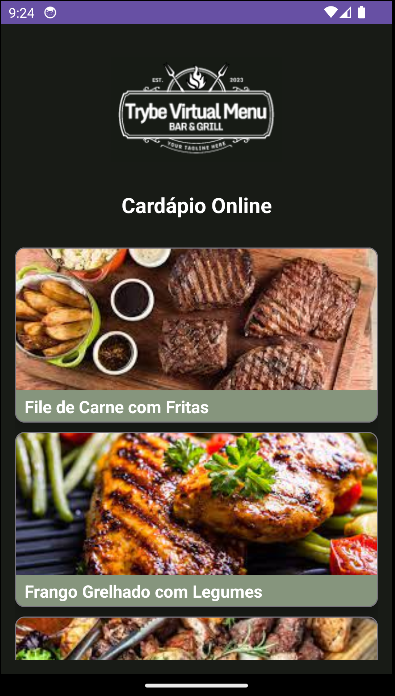
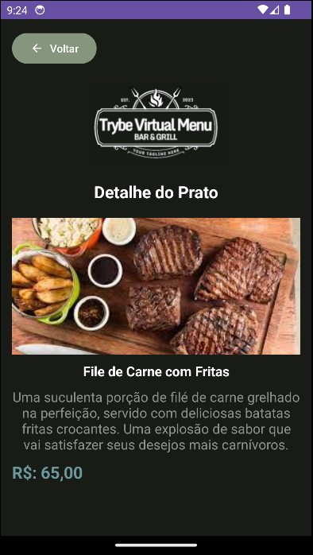
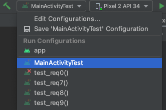
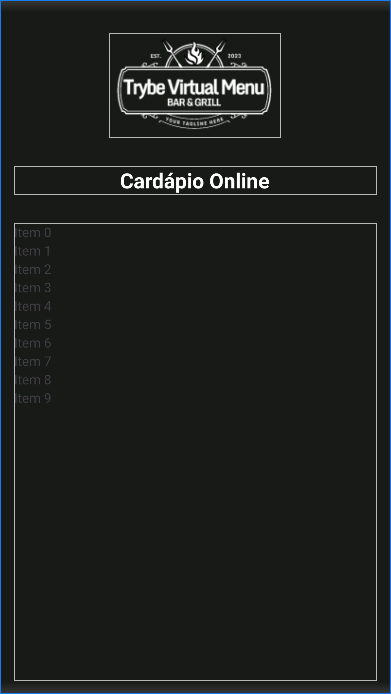
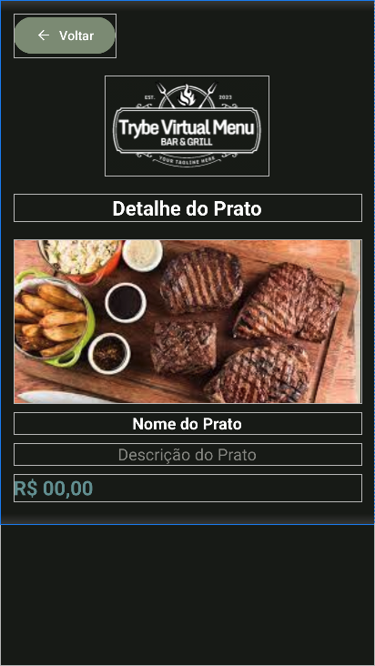
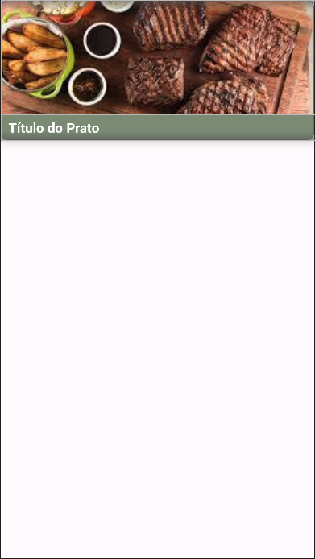

# Boas-vindas ao repositório do projeto Trybe Virtual Menu

|  |  |
|:---:| :---: |

<br />

Para realizar o projeto, atente-se a cada passo descrito a seguir, e se tiver **qualquer dúvida**, nos envie no _Slack_ da turma! #vqv 🚀

Aqui, você vai encontrar os detalhes de como estruturar o desenvolvimento do seu projeto a partir desse repositório, utilizando uma branch específica e um _Pull Request_ para colocar seus códigos.

<br />

## Termos e acordos

Ao iniciar este projeto, você concorda com as diretrizes do [Código de Conduta e do Manual da Pessoa Estudante da Trybe](https://app.betrybe.com/learn/student-manual/codigo-de-conduta-da-pessoa-estudante).

<br />

## Entregáveis

<details><summary><strong>🤷🏽‍ Como entregar</strong></summary><br />

Para entregar o seu projeto, você deverá criar um _Pull Request_ neste repositório.

Lembre-se que você pode consultar nosso conteúdo sobre [Git & GitHub](https://app.betrybe.com/learn/course/5e938f69-6e32-43b3-9685-c936530fd326/module/f04cdb21-382e-4588-8950-3b1a29afd2dd/section/876a615b-f578-4d65-a820-de9f3e5e57db/lesson/be8632bf-7bb7-4c01-a5d9-7aadac3a58f0) sempre que precisar!
<br /></details>

<details><summary><strong>🧑‍💻 O que deverá ser desenvolvido</strong></summary><br />

Você será responsável por desenvolver uma aplicativo de um cardápio virtual, consistindo em duas telas: a primeira exibindo uma lista de itens e a segunda fornecendo detalhes do item selecionado. Neste estágio, não será necessário estabelecer conexões com APIs externas, pois estaremos trabalhando com dados fixos.

<br /></details>

<details><summary><strong>📝 Habilidades a serem trabalhadas </strong></summary><br />

Neste projeto, verificaremos se você é capaz de:

- Utilizar Kotlin para manipular os elementos visuais do Android;
- Utilizar Kotlin para desenvolver regras de negócio da interface;
- Construir layout via XML;
- Posicionar os elementos visuais com ViewGroup;
- Trabalhar com listas de maneira adequada;
- Navegar entre telas de forma coerente e funcional

<br /></details>

<details><summary><strong>🗓 Data de Entrega</strong></summary><br />

- Este projeto é individual;

- Será 1 dia de projeto;

- Data para entrega final do projeto: `20/11/2023 14:00`.

<br /></details>

## Orientações

<details><summary><strong>‼ Antes de começar a desenvolver</strong></summary><br /> 

#### 1. Clone o repositório

- Use o comando: `git clone git@github.com:tryber/android-029-android-projeto-trybe-virtual-menu.git`

- Entre na pasta do repositório que você acabou de clonar:

    - `cd android-029-android-projeto-trybe-virtual-menu`

#### 2. Instale as dependências

- Entre no arquivo `build.gradle` localizado dentro do diretório **app**

- Clique no botão `Sync Now` caso ele exista; se a opção não estiver disponível, significa que a sincronização automática já foi realizada ao abrir o Android Studio.

#### 3. Crie uma branch a partir da branch `main`

- Verifique que você está na branch `main`. Use o comando `git branch` para isso

- Se você não estiver, mude para a branch `main`. Use `git checkout main`

- Agora, crie uma branch à qual você vai submeter os `commits` do seu projeto.

    - Você deve criar uma branch no formato `{seu-nome-e-sobrenome}-{nome-do-projeto}`. Exemplo: `italo-moura-projeto-trybe-virtual-menu`

    - Exemplo: `git checkout -b italo-moura-projeto-trybe-virtual-menu`

#### 4. Adicione as mudanças ao _stage_ do Git e faça um `commit`

- Verifique que as mudanças ainda não estão no _stage_. O comando `git status` irá mostrar essa informação para você, mostrando os arquivos em vermelho

- Adicione o novo arquivo ao _stage_ do Git. Use `git add .` para adicionar **todos** os arquivos ao _stage_ ou `git add nome-do-arquivo` para adicionar um arquivo específico

- Verifique com o comando `git status` que os arquivos adicionados ao _stage_ agora estão verde

- Faça o `commit` inicial com o comando `git commit -m "Iniciando o projeto"`

- Verifique com `git status` que você não possui mais alterações para serem commitadas. A mensagem _nothing to commit_ ou similar deve aparecer

- Adicione a sua branch com o novo `commit` ao repositório remoto com o comando `git push`. Exemplo: `git push -u origin italo-moura-projeto-trybe-virtual-menu`

#### 5. Crie um novo `Pull Request` _(PR)_

- Vá até a página de _Pull Requests_ do [repositório no GitHub](https://github.com/betrybe/android-029-android-projeto-trybe-virtual-menu/pulls)

- Clique no botão verde _"New pull request"_

- Clique na caixa de seleção _"Compare"_ e escolha a sua branch **com atenção**

- Coloque um título para o seu _Pull Request_

- Exemplo: _"[Gabriel Oliva] Projeto Login Social"_

- Clique no botão verde _"Create pull request"_

- Adicione uma descrição para o _Pull Request_, um título nítido que o identifique, e clique no botão verde _"Create pull request"_

- Volte até a [página de _Pull Requests_ do repositório](https://github.com/betrybe/android-029-android-projeto-trybe-virtual-menu/pulls) e confira se o seu _Pull Request_ está criado

<br /></details>

<details><summary><strong>⌨️ Durante o desenvolvimento</strong></summary><br />

Faça `commits` das alterações que você fizer no código regularmente, pois assim você garante visibilidade para o time da Trybe e treina essa prática para o mercado de trabalho. 😀

- Lembre-se de sempre após um (ou alguns) `commits` atualizar o repositório remoto

- Os comandos que você utilizará com mais frequência são:

    - `git status` _(para verificar o que está em vermelho - fora do stage - e o que está em verde - no stage)_;
    - `git add` _(para adicionar arquivos ao stage do Git)_;
    - `git commit` _(para criar um commit com os arquivos que estão no stage do Git)_;
    - `git push -u origin nome-da-branch` _(para enviar o commit para o repositório remoto na primeira vez que fizer o `push` de uma nova branch)_;
    - `git push` _(para enviar o commit para o repositório remoto após o passo anterior)_.

<br /></details>

<details><summary><strong>🎛 Linter</strong></summary><br />

Usaremos o [Ktlint](https://pinterest.github.io/ktlint/) para fazer o lint do seu código.

Este projeto já vem com as dependências relacionadas ao _linter_ configuradas no arquivo `build.gradle`, lembre-se de instalá-las.

Para poder rodar o `Ktlint` de forma local, rode o comando de acordo com o sistema operacional:

Mac ou Linux:
```bash
./gradlew ktlintCheck
```

Windows:
```bash
gradlew ktlintCheck
```

Se a análise do `Ktlint` encontrar problemas no seu código, tais problemas serão mostrados no seu terminal.

<br /></details>

<details><summary><strong>👀 Analisador estático de código</strong></summary><br />

Usaremos o [Detekt](https://detekt.dev/) para fazer a análise estática do seu código.

Este projeto já vem com as dependências relacionadas ao _linter_ configuradas no arquivo `build.gradle`, lembre-se de instalá-las.

Para poder rodar o `Detekt` de forma local, rode o comando de acordo com o sistema operacional:

Mac ou Linux:
```bash
./gradlew detekt
```

Windows:
```bash
gradlew detekt
```

Se a análise do `Ktlint` encontrar problemas no seu código, tais problemas serão mostrados no seu terminal.
</details>

<details>
<summary><strong>🛠 Testes</strong></summary><br />

Todos os requisitos do projeto serão testados automaticamente por meio do `Espresso`, uma ferramenta que testa interfaces. Você pode rodar o teste instrumentado no Android Studio ou via linha de comando.

#### Android Studio

Abra a aba `Run` e selecione o arquivo de teste, conforme exemplo abaixo:



#### Linha de comando

- Abra o emulador

- Execute o comando
    - Mac ou Linux: `./gradlew connectedAndroidTest`
    - Windows: `gradlew connectedAndroidTest`

#### Avaliação

Os requisitos do seu projeto são avaliados automaticamente. Para verificar se a sua avaliação foi computada com sucesso, você pode verificar os **detalhes da execução do avaliador**:

- Na página do seu _Pull Request_, acima do "botão de merge", procure por `Evaluator job` e clique no link `Details`;

- Na página que se abrirá, procure pela linha `Evaluator step` e clique nela;

- Caso tenha dúvidas, peça ajuda no _Slack_.

⚠️ **O avaliador automático não necessariamente avalia seu projeto na ordem em que os requisitos aparecem no README. Isso acontece para deixar o processo de avaliação mais rápido. Então, não se assuste se isso acontecer, ok?**

O não cumprimento de um requisito, total ou parcialmente, impactará em sua avaliação.
<br /></details>

<details>
<summary><strong>🏗 Estrutura do projeto</strong></summary> <br />

O seu Pull Request deverá conter, obrigatoriamente, os arquivos `MainActivity.kt`, `activity_main.xml`, `MenuItemDetailActivity.kt`, `activity_menu_item_detail.xml` e `item_menu_layout.xml`.

As imagens pedidas no projeto estão dentro da pasta _/res_.

⚠️ É importante que seus arquivos tenham exatamente estes nomes!

Caso sinta a necessidade de adicionar outros arquivos além destes, sinta-se à vontade.

<br /></details>

# Requisitos do projeto

## `1 - Crie a estrutura da tela Inicial do Cardápio`

A tela principal terá seu conteúdo dentro de um contêiner, que será um LinearLayout. Neste primeiro requisito, iremos realizar a configuração inicial do contêiner e inserir os elementos que estarão contidos nele:

- Logo do restaurante.
- Título da tela inicial.
- Uma lista de itens do cardápio.

<details><summary><strong>️📱 Tela</strong></summary><br />

|                                                                                                                               |
|:-------------------------------------------------------------------------------------------------------------------------------------------------------:|
| activity_main.xml |

<br /></details>

<details><summary><strong>👩‍💻 Regras de implementação</strong></summary>

### Onde desenvolver

- O arquivo que você implementará o layout será o `activity_main.xml` que estar dentro do diretório `src/res/layout`;

### Estrutura da tela

```
App
└── LinearLayout
    └── ShapeableImageView
    └── MaterialTextView
    └── RecyclerView
```

### Regras de negócio

#### LinearLayout

- **Configuração**
    - Deve ser o elemento raíz da tela
    - Deve ter o id `main_linear_container`
    - Orientação deve ser `vertical`
- **Layout**
    - Largura e altura devem ser a mesma do elemento pai
    - Um preenchimento de `15dp`
    - Uma cor de fundo `@color/primary`

#### Imagem da logo

- **Configuração**
    - O elemento deve ser uma `ShapeableImageView`
    - Deve ser elemento filho do LinearLayout
    - Deve ter o id `main_logo`
    - A imagem da logo deve ser a que se encontra na pasta `res/drawable/logo.png`
- **Layout**
    - Largura e altura devem envolver o conteúdo
    - A margem de cima deve ter `20dp`
    - A margem de baixo deve ter `30dp`
    - A imagem deve ser centralizada horizontalmente

### O que será testado

- O elemento LinearLayout existe
- O elemento ImageView existe e é filho do elemento LinearLayout
- O elemento TextView existe e é filho do elemento LinearLayout
- O elemento RecyclerView existe e é filho do elemento LinearLayout

<br/></details>

## `2 - Crie a estrutura da tela de Detalhe do Prato`

A tela de detalhes do prato terá seu conteúdo inserido em um contêiner, que será uma ScrollView. Neste requisito, realizaremos a configuração do contêiner e a inclusão dos elementos que estarão contidos nele:

- Container LinearLayout
- Logo do restaurante.
- Título da tela de detalhe.
- Botão de voltar.
- Imagem do prato.
- Título do prato.
- Descrição do prato.
- Valor do prato.

<details><summary><strong>️📱 Tela</strong></summary><br />

|                                                                                                                               |
|:-------------------------------------------------------------------------------------------------------------------------------------------------------:|
| activity_menu_item_detail.xml |

<br /></details>

<details><summary><strong>👩‍💻 Regras de implementação</strong></summary>

### Onde desenvolver

- O arquivo que você implementará o layout será o `activity_menu_item_detail.xml` que estar dentro do diretório `src/res/layout`;

### Estrutura da tela

```
App
└── ScrollView
    └── LinearLayout
        └── MaterialButton
        └── ShapeableImageView
        └── MaterialTextView
        └── ShapeableImageView
        └── MaterialTextView
        └── MaterialTextView
        └── MaterialTextView
```

### Regras de negócio

#### ScrollView

- **Configuração**
    - Deve ser o elemento raíz da tela
    - Deve ter o id `detail_scroll_view`
- **Layout**
    - Largura e altura correspondem ao elemento pai
    - Cor de fundo definida como `@color/primary`

#### LinearLayout

- **Configuração**
    - Deve ser o elemento raíz da tela
    - Deve ter o id `detail_linear_container`
    - Orientação deve ser `vertical`
- **Layout**
    - Largura corresponde ao elemento pai
    - Altura deve envolver o conteúdo
    - Um preenchimento de `15dp`

#### Button

- **Configuração**
    - O elemento deve ser um `MaterialButton`
    - Deve ser elemento filho do LinearLayout
    - Deve ter o id `detail_back`
- **Layout**
    - Largura e altura devem envolver o conteúdo
    - Cor de fundo definida como `@color/secondary`.
    - Cor do texto: definida como branco.
    - Ícone: definido como `@drawable/arrow_back`.
    - Tonalidade do ícone: definida como branco.
    - Texto: texto definido em `@string/back`.

#### ImageView

- **Configuração**
    - O elemento deve ser um `ShapeableImageView`
    - Deve ser elemento filho do LinearLayout
    - Deve ter o id `detail_logo`
    - A imagem da logo deve ser a que se encontra na pasta res/drawable/logo.png
- **Layout**
    - Largura e altura devem envolver o conteúdo
    - A imagem deve ser centralizada horizontalmente
    - Margem superior e inferior `20dp`.

#### TextView

- **Configuração**
    - O elemento deve ser um `MaterialTextView`
    - Deve ser elemento filho do LinearLayout
    - Deve ter o id `detail_title`
- **Layout**
    - Largura deve corresponder ao elemento pai
    - Altura deve envolver o conteúdo
    - Margem inferior de `20dp`
    - Cor do texto definida como `branco`
    - Estilo do texto em `negrito`
    - Tamanho do texto de `22sp`
    - Alinhamento do texto ao centro
    - Texto definido como `Detalhe do Prato`

#### ImageView

- **Configuração**
    - O elemento deve ser um `ShapeableImageView`
    - Deve ser elemento filho do LinearLayout
    - Deve ter o id `detail_image`
- **Layout**
    - Largura correspondem ao elemento pai
    - Altura de `180dp`
    - Margem inferior de `10dp`
    - Tipo de escala centro e recorte
    - Imagem definida com a imagem do prato selecionado

#### TextView

- **Configuração**
    - O elemento deve ser um `MaterialTextView`
    - Deve ser elemento filho do LinearLayout
    - Deve ter o id `detail_name`
- **Layout**
    - Largura corresponde ao elemento pai
    - Altura deve envolver o conteúdo
    - Margem inferior de `10sp`
    - Alinhamento do texto no centro horizontal
    - Cor do texto: definida como `branco`
    - Estilo do texto em `negrito`
    - Tamanho do texto: `18sp`

#### TextView

- **Configuração**
    - O elemento deve ser um `MaterialTextView`
    - Deve ser elemento filho do LinearLayout
    - Deve ter o id `detail_description`
- **Layout**
    - Largura corresponde ao elemento pai
    - Altura deve envolver o conteúdo
    - Margem inferior de `10sp`
    - Alinhamento do texto no centro horizontal
    - Cor do texto: definida como `cinza`
    - Tamanho do texto: `18sp`

#### TextView

- **Configuração**
    - O elemento deve ser um `MaterialTextView`
    - Deve ser elemento filho do LinearLayout
    - Deve ter o id `detail_price`
- **Layout**
    - Largura corresponde ao elemento pai
    - Altura deve envolver o conteúdo
    - Margem inferior de `10sp`
    - Alinhamento do texto a esquerda
    - Cor do texto definida como `@color/Tertiary`
    - Tamanho do texto: `18sp`

### O que será testado

- O elemento ScrollView existe
- O elemento LinerLayout existe e é filho do elemento ScrollView
- O elemento Button existe e é filho do elemento LinearLayout
- Os elementos ImageView existem e são filhos do elemento LinearLayout
- Os elementos TextView existem e são filhos do elemento LinearLayout

<br/></details>

## `3 - Crie a lista de pratos disponíveis no cardápio`

Crie a lógica para carregar a lista de pratos disponíveis no cardápio do nosso restaurante. Você pode fazê-lo utilizando os conceitos de data class, Adapters, e interface que aprendemos até agora. Para a lista, utilize os seguintes itens do cardápio:

| Nome do Prato | Imagem | Descrição | Preço |
|---------------|--------|-----------|-------|
| File de Carne com Fritas | R.drawable.prato_01  | Uma suculenta porção de filé de carne grelhado na perfeição, servido com deliciosas batatas fritas crocantes. Uma explosão de sabor que vai satisfazer seus desejos mais carnívoros. | R$ 65,00 |
| Frango Grelhado com Legumes | R.drawable.prato_02 | Uma opção saudável e saborosa: peitos de frango suculentos grelhados à perfeição, acompanhados de legumes frescos, preparados para manter a crocância e o sabor. Uma refeição leve e deliciosa para quem busca um toque de frescor. | R$ 45,00 |
| Mix de File de Carne e Frango Grelhados | R.drawable.prato_03 | A melhor escolha para os indecisos! Uma combinação harmoniosa de filé de carne suculento e peito de frango grelhado, oferecendo uma explosão de sabores em cada garfada. Acompanhado de opções de molhos que tornam essa escolha ainda mais especial. | R$ 85,00 |
| Picanha Grelhada com Macaxeira Frita | R.drawable.prato_04 | Uma refeição de dar água na boca! Picanha de primeira qualidade, grelhada à perfeição e servida com macaxeira frita crocante. Um prato que celebra o melhor da culinária brasileira. | R$ 90,00 |
| Porção de Batatas Fritas com Molho | R.drawable.prato_05 | Para os amantes de batatas, esta é a escolha ideal. Nossas batatas fritas são cortadas e preparadas na hora para garantir a crocância perfeita. Acompanhadas de uma variedade de molhos incríveis que vão tornar cada mordida ainda mais especial. Acompanhamento perfeito para qualquer refeição. | R$ 20,00 |
| Suco de Laranja | R.drawable.bebida_01 | Um gole de pura refrescância e vitalidade. Nosso suco de laranja é feito com as laranjas mais suculentas e frescas, espremidas na hora para garantir o sabor cítrico e natural que todos adoram. Perfeito para acompanhar suas refeições ou para matar a sede a qualquer hora do dia. Deleite-se com o gosto da natureza em um copo. | R$ 10,00 |

<details><summary><strong>👩‍💻 Regras de implementação</strong></summary>

### O que será testado

- A lista de pratos carregadas no RecyclerView tem a quantidade correta
- Os elementos das lista estão com o nomes corretos iguais a lista a cima

<br/></details>

## `4 - Crie o layout responsável por cada item do cardápio`

O layout terá seu conteúdo dentro de um container, que será um MaterialCardView. Vamos fazer a configuração container e inserir os elementos que ficaram dentro dele:

- Um container LinearLayout
- Uma imagem do prato
- O título do prato

<details><summary><strong>️📱 Tela</strong></summary><br />

|                                                                                                                               |
|:-------------------------------------------------------------------------------------------------------------------------------------------------------:|
| item_menu_layout.xml |

<br /></details>

<details><summary><strong>👩‍💻 Regras de implementação</strong></summary>

### Onde desenvolver

- O arquivo que você implementará o layout será o `item_menu_layout.xml` que estar dentro do diretório `src/res/layout`;

### Estrutura da tela

```
App
└── MaterialCardView
    └── LinearLayout
        └── ShapeableImageView
        └── MaterialTextView
```

### Regras de negócio

#### MaterialCardView

- **Configuração**
    - Deve ser o elemento raíz da tela
    - Deve ter o id `item_menu_card_view`
- **Layout**
    - Largura deve ser a mesma do elemento pai
    - Altura deve envolver o conteúdo
    - Uma cor de fundo de do elemento de layout `@color/secondary`
    - A margem de baixo deve ter `10dp`
    - Os cantos devem ter um arredondamento de `10dp`
    - Uma elevação de `10dp`

#### LinearLayout

- **Configuração**
    - Deve ter o id `item_menu_linear_container`
    - Orientação deve ser `vertical`
    - Deve ser elemento filho do MaterialCardView
- **Layout**
    - Largura deve ser a mesma do elemento pai
    - Altura deve envolver o conteúdo

#### Imagem da logo

- **Configuração**
    - O elemento deve ser uma `ShapeableImageView`
    - Deve ser elemento filho do LinearLayout
    - Deve ter o id `item_menu_image`
- **Layout**
    - Largura deve envolver o conteúdo
    - Altura deve ter `150dp`
    - Tipo de escala centro e recorte
    - Imagem definida com a imagem do prato selecionado

#### TextView

- **Configuração**
    - O elemento deve ser um `MaterialTextView`
    - Deve ser elemento filho do LinearLayout
    - Deve ter o id `item_menu_name`
- **Layout**
    - Largura corresponde ao elemento pai
    - Altura deve envolver o conteúdo
    - Espaçamento inferior de `5dp`
    - Espaçamento superior de `5dp`
    - Espaçamento do inicio de `10dp`
    - Espaçamento do fim de `10dp`
    - Cor do texto definida como `branca`
    - Estilo da fonte em `Negrito`
    - Tamanho do texto `18sp`

### O que será testado

- O elemento MaterialCardView existe
- O elemento LinearLayout existe e é filho do elementro MaterialCardView
- O elemento ImageView existe e é filho do elemento LinearLayout
- O elemento TextView existe e é filho do elemento LinearLayout

<br/></details>

## `5 - Crie o evento para clicar no item do menu`

Desenvolva a lógica para implementar um evento de clique nos itens do RecyclerView, a fim de redirecionar o usuário para a tela de Detalhes do prato. Ao clicar em um item do menu, a atividade de detalhes do item correspondente deve ser iniciada com base no item selecionado.

<details><summary><strong>👩‍💻 Regras de implementação</strong></summary>

### O que será testado

- Se o RecyclerView existe
- Que é possível clicar em um item no RecyclerView
- Que a tela de detalhes do prato seja aberta
- Que o item clicado corresponde ao que é exibido na tela de detalhes do prato

<br/></details>

## `6 - Crie o evento do botão de voltar da tela de detalhe do prato`

Desenvolva a lógica para implementar um evento de clique no botão voltar da tela de detalhe do prato, a fim de redirecionar o usuário de volta à tela principal.

<details><summary><strong>👩‍💻 Regras de implementação</strong></summary>

### O que será testado

- Se o RecyclerView existe
- Que é possível clicar em um item no RecyclerView
- Que a tela de detalhes do prato seja aberta
- Que o item clicado corresponde ao que é exibido na tela de detalhes do prato
- Que ao clicar no botão voltar será exibido a tela principal do aplicativo

<br/></details>

---

<details>
<summary><strong>🗣 Nos dê feedbacks sobre o projeto!</strong></summary><br />

Ao finalizar e submeter o projeto, não se esqueça de avaliar sua experiência preenchendo o formulário.
**Leva menos de 3 minutos!**

[Formulário de avaliação do projeto](https://be-trybe.typeform.com/to/ZTeR4IbH#cohort_hidden=CH29-ANDROID&template=betrybe/android-0x-projeto-trybe-virtual-menu)

<br /></details>

<details>
<summary><strong>🗂 Compartilhe seu portfólio!</strong></summary><br />

Você sabia que o LinkedIn é a principal rede social profissional e compartilhar o seu aprendizado lá é muito importante para quem deseja construir uma carreira de sucesso? Compartilhe esse projeto no seu LinkedIn, marque o perfil da Trybe (@trybe) e mostre para a sua rede toda a sua evolução.

<br /></details>
